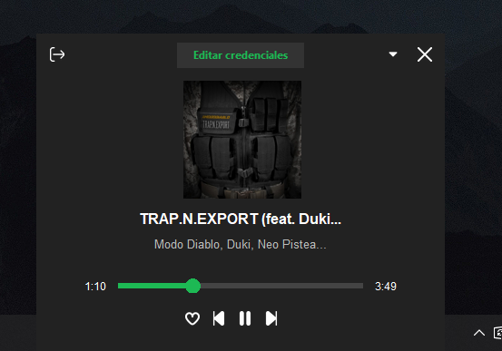

# Spoty‑TB


> Aplicación ligera en Python que se aloja en la **bandeja del sistema** de Windows y te permite **controlar y visualizar** la música que suena en Spotify sin abrir la app principal.

## Tabla de contenidos

- [Descripción](#descripción)
- [Características](#características)
- [Capturas de pantalla](#capturas-de-pantalla)
- [Tecnologías usadas](#tecnologías-usadas)
- [Instalación](#instalación)
  - [Instalador (.exe)](#instalador-exe)
  - [Construir desde el código fuente](#construir-desde-el-código-fuente)
- [Configuración](#configuración)
- [Distribución](#distribución)
- [Hoja de ruta](#hoja-de-ruta)
- [Contribuir](#contribuir)
- [Licencia](#licencia)
- [Créditos](#créditos)

---

## Descripción

**Spoty‑TB** es una mini‑aplicación para Windows 10/11 escrita en Python 3.11. Se minimiza a la bandeja del sistema y ofrece un *mini‑player* con la información de la pista actual, controles multimedia y una experiencia fluida y no intrusiva.

Incluye funciones como:
- Mostrar título, artista y carátula actual
- Controles de reproducción, avance y retroceso
- Animación expandible con barra de progreso
- Autenticación OAuth segura con backend local
- Actualización automática del token de acceso
- Posibilidad de exportar como `.exe` portable para Windows

---

## Características

- 🎵 Muestra título y artista de la canción actual.
- ⏯️ Controles: **Anterior · Reproducir/Pausar · Siguiente**.
- 📈 Barra de progreso interactiva en la vista expandida.
- 🔄 Renovación automática del *access token* mediante OAuth **PKCE** con backend local.
- 🌙 Inicia minimizada para no interrumpir tu flujo.
- 🔼 Flecha para expandir y mostrar controles adicionales.
- 🛠 Generación de **.exe** portátil usando PyInstaller.

---

## Capturas de pantalla

| Compacta | Expandida |
| -------- | --------- |
|  |  |

---

## Tecnologías usadas

### Lenguaje y GUI
- 
- 
- [customtkinter](https://github.com/TomSchimansky/CustomTkinter)

### Librerías y herramientas
- [Requests](https://docs.python-requests.org/en/latest/) – Para solicitudes HTTP.
- [Pillow](https://python-pillow.org/) – Para manejo de imágenes.
- [pystray](https://github.com/moses-palmer/pystray) – Para el icono en la bandeja del sistema.
- [pyinstaller](https://pyinstaller.org/en/stable/) – Para empaquetar como `.exe`.

### APIs y servicios
-  – Para obtener y controlar la música reproducida.
- Backend local en Python – Implementado con OAuth2 PKCE para manejar de forma segura la autenticación del usuario y la renovación de tokens.

---

## Requisitos

- Windows 10 (64 bits)
- Spotify instalado y en ejecución
- Python ≥ 3.11 (solo si lo ejecutarás desde el código fuente)
- Cuenta de Spotify válida para la autenticación

---

## Instalación

### Instalador (.exe)

1. Descarga la **última versión** desde la pestaña **Releases**.
2. Ejecuta `spoty-tb.exe`.
3. Al iniciarlo por primera vez, te pedirá ingresar los **Client ID** y **Client Secret** de la API de Spotify.
4. Luego, abrirá el navegador para que inicies sesión y autorices la app con tu cuenta de Spotify.
5. Al completar la autenticación, Spoty‑TB se minimizará a la bandeja y estará listo para usarse.

### Construir desde el código fuente

```bash
# Clona el repo y entra en él
git clone https://github.com/Brianmartinezsebas/Spoty-TB.git
cd Spoty-TB

# Crea entorno virtual y activa (solo si lo deseas)
python -m venv .venv
.venv\Scripts\activate  # PowerShell / CMD

# Instala dependencias
pip install -r requirements.txt

# Ejecuta la app en modo desarrollo
python main.py
```

Para generar un ejecutable portátil:

```bash
pyinstaller --noconsole --onefile --add-data "assets;assets" main.py
```

El binario aparecerá en `dist/spoty-tb.exe`.

---

## Configuración

La aplicación utiliza un backend local para gestionar la autenticación con Spotify. Al iniciar por primera vez, te solicitará ingresar los Client ID y Client Secret de la API de Spotify. Luego, abrirá tu navegador para que inicies sesión y autorices la aplicación.

---

## Distribución

La marca y el logotipo de Spotify son propiedad de **Spotify AB**. Spoty‑TB no está afiliado, asociado ni respaldado por Spotify.

---

## Hoja de ruta

- [x] Soporte completo para systray en Windows
- [x] Control de sesión Spotify con refresh token
- [x] UI animada en Tkinter (mini player expandible)
- [x] Exportar como `.exe` con `pyinstaller`
- [x] Barra de progreso
- [x] Favoritos y Control de Volumen
- [ ] Botones Aleatorio y Repetir
- [ ] Ver siguiente y anterior (modo expandido)
- [ ] Ver cola de reproduccion
- [ ] Busqueda
- [ ] Tema oscuro / claro automático (editable)
- [ ] Transferir Playback a otros dispositivos
- [ ] Internacionalización (i18n) — soporte para inglés y otros idiomas
- [ ] Soporte para Apple Music y otros servicios con APIs oficiales
- [ ] Soporte para Windows 11 (64 bits)
- [ ] Soporte multi‑monitor

---

## Contribuir

1. Haz un *fork* del proyecto.
2. Crea tu rama (`git checkout -b feat/nueva-funcionalidad`).
3. Haz commit de tus cambios (`git commit -m 'feat: añade ...'`).
4. Empuja la rama (`git push origin feat/nueva-funcionalidad`).
5. Abre un *Pull Request*.

---

## Licencia

Distribuido bajo la **Licencia MIT**. Consulta el archivo [`LICENSE`](LICENSE) para más detalles.

---

## Créditos

Hecho con ❤️ por **Brian Martínez** · [Sitio web](https://spoty-tb.brianmartinezsebas.com.ar)
