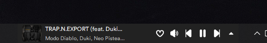

# Spoty-TB 🎵

Spoty-TB es una aplicación ligera para Windows que permite controlar y visualizar la música que se está reproduciendo en Spotify desde la bandeja del sistema, sin necesidad de abrir la app principal. Ideal para quienes quieren acceso rápido a sus controles multimedia y la información de la canción actual, todo en un diseño minimalista y sencillo.

---

## 🧩 Funcionalidades

- Ver el nombre de la canción actual y su artista
- Botones de control: ⏮️ Anterior | ⏯️ Reproducir/Pausar | ⏭️ Siguiente
- Ícono ligero en la bandeja del sistema
- Inicia minimizado y no interrumpe al usuario

## Capturas de pantalla

---

## 🖥️ Requisitos

- Windows 10 o superior (64 bits)
- Tener la aplicación oficial de **Spotify** instalada y abierta

---

## 📦 Instalación

### 🔹 Opción recomendada: Instalador

1. Descargá el instalador desde la [sección Releases](https://github.com/Brianmartinezsebas/Spoty-TB/releases)
2. Ejecutá el archivo `spoty-tb.exe`
3. (Opcional) Elegí si querés acceso directo en el escritorio
4. ¡Listo! Spoty-TB se ejecutará al finalizar la instalación
5. Se abrirá en tu navegador una pagina para Iniciar Sesión en tu cuenta de Spotify

---

## 🚫 Notas

- Algunos antivirus pueden marcar los `.exe` generados manualmente como "desconocidos". Podés confiar en el archivo si proviene de este repositorio.
- Spoty-TB **no accede a internet ni recolecta datos**.
- La app está en desarrollo y puede expandirse con nuevas funcionalidades.

---

## 👨‍💻 Autor

**Brian Martínez**  
[https://spoty-tb.brianmartinezsebas.com.ar](https://spoty-tb.brianmartinezsebas.com.ar)

---

## 📜 Licencia

MIT License. Ver [LICENSE](./LICENSE).
